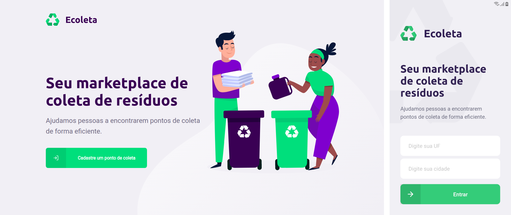

<h1 align="center">
    
</h1>

<p align="center">
  

  
  
  <a href="https://github.com/gustavo-tp/ecoleta/commits/master">
    
  </a>

  <a href="https://github.com/gustavo-tp/ecoleta/issues">
    
  </a>

  
</p>

<p align="center">
  <a href="#description">Description</a>&nbsp;&nbsp;&nbsp;|&nbsp;&nbsp;&nbsp;
  <a href="#technologies-used">Technologies used</a>&nbsp;&nbsp;&nbsp;|&nbsp;&nbsp;&nbsp;
  <a href="#prerequisites">Prerequisites</a>&nbsp;&nbsp;&nbsp;|&nbsp;&nbsp;&nbsp;
  <a href="#installing">Installing</a>&nbsp;&nbsp;&nbsp;|&nbsp;&nbsp;&nbsp;
  <a href="#acknowledgments">Acknowledgments</a>
</p>

<p align="center">
  
</p>

## Description

Application that helps people find waste collection points.

### Technologies used

- [Node.js](https://nodejs.org/en/)
- [ReactJS](https://reactjs.org)
- [React Native](https://facebook.github.io/react-native/)
- [Expo](https://expo.io/)

### Prerequisites

If you do not have any of the software below, follow the link to install

- [Installing Git](https://git-scm.com/downloads)
- [Installing Node.js via package manager](https://nodejs.org/en/download/package-manager/)
- [Installing Yarn](https://yarnpkg.com/en/docs/install#debian-stable)
- [Installing Expo](https://facebook.github.io/react-native/docs/getting-started)

### Installing

Follow the steps below to run the project on your computer. (using terminal or git bash)

1. Clone this repository
```
git clone git@github.com:gustavo-tp/ecoleta.git
```
2. Run Backend
```
cd ecoleta/backend
npm install
npm start
```
3. Run WEB App
```
cd ../frontend
npm install
npm start
```
4. Run Mobile App
```
cd ../mobile
npm install
npm start
```
Then open the Expo app on your phone and scanned the QR code.

### Acknowledgments
[](https://github.com/Rocketseat)
[](https://github.com/diego3g)
